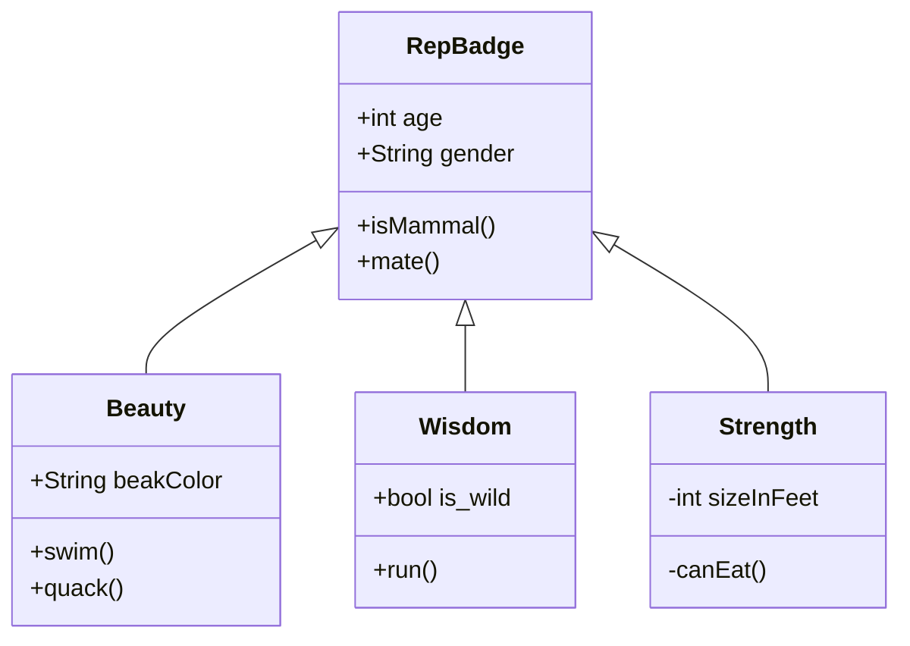

```mermaid
classDiagram
    RepBadge <|-- Beauty
    RepBadge <|-- Wisdom
    RepBadge <|-- Strength
    RepBadge : +int age
    RepBadge : +String gender
    RepBadge: +isMammal()
    RepBadge: +mate()
    class Beauty {
      +String beakColor
      +swim()
      +quack()
    }
    class Strength {
      -int sizeInFeet
      -canEat()
    }
    class Wisdom {
      +bool is_wild
      +run()
    }
```